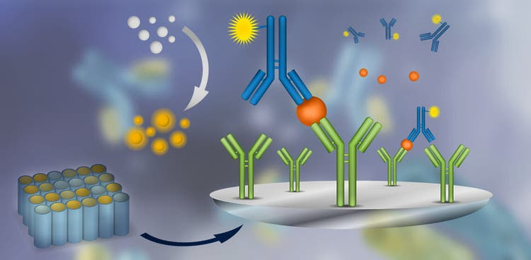

 

## Wet Lab Reports

 

#### [Insertion of Target DNA in Vector and Performing DNA Sequencing Using Transformed Bacteria](files/projects/Insertion of DNA in Vector.pdf)

 

#### [Measuring the Activity of Lactate Dehydrogenase Obtained from Purified Muscle Protein](files/projects/MeasuringtheActivityofLactateDehydrogenaseObtainedfromPurifiedMuscleProtein.pdf)

 

#### [Utilizing Specificity of Immune Response to Analyze Subunits of IgY](files/projects/ELISA Analysis.pdf)

[ELISA steps visual](files/projects/ELISAstepvisual.pdf)

